- 👋 Hi, I’m @luanpersini
- 👀 I’m interested in development and software architecture
- 🌱 I’m currently working with Typescript, Node, TDD, React, Clean Architecture, Solid
- 📫 How to reach me https://www.linkedin.com/in/luan-persini-80a6572b/

---
💻 Main Tech Stack

    

     

---
https://github.com/devicons/devicon/blob/master/icons/sequelize/sequelize-original-wordmark.svg