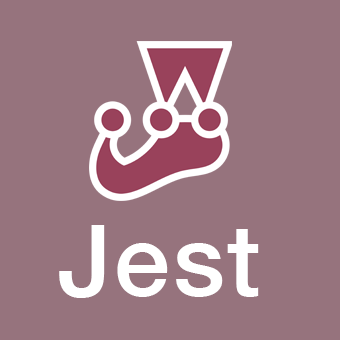

### 👋 Hi, I’m Luan Persini

I have 5+ years of experience with software development and testing. Im specializing in API development and i have good knowledge of NodeJs, Typescript, solid, clean code, and API testing with Jest. Im also improving my skills in C# .Net. I have a good range of experience and graduations related to business and process improvement in general.

In this repository you will find materials about Typescript, Node, C# .Net and Software Testing. Hope you enjoy.

---
💻 Main Tech Stack

      

:student: Im Also Getting Good At

   

---