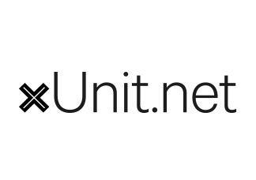

### 👋 Hi There!

I’m Luan Persini, a Fullstack developer with 5+ years of experience working with software development and testing (QA). I have good knowledge of NodeJs, Typescript, solid, clean code, and API testing with Jest. I have a good range of experience and graduations related to business and process improvement in general.

My currently goal is to improve my skills in C# and Java SpringBoot and, at the same time, keep evolving in my main stack, writhing about advanced topics of Typescript and Learning Vue, Next and Angular for the frontend.

In this repository you will find content about Typescript, NodeJS, C#, Software Testing, and other related technologies, with theory and practice. Hope you enjoy it.

How to reach me: https://www.linkedin.com/in/luan-persini-80a6572b/

---
💻 Main Tech Stack

      

:student: Im Also Getting Good At

   

---

# Repositories and Content

## Typescript/NodeJs

- [CQS Implementation using NestJS](https://github.com/luanpersini/nodejs-nestjs-cqs)
- [Testing NodeJS/NestJS APIs Using Jest - Unit, Integration and End-To-End tests](https://github.com/luanpersini/tests-node-backend-tests-using-jest-typescript)
- [CRUD using NestJS with Swagger, NestJS Logger](https://github.com/luanpersini/venturus-backend-printer-challange)
- [Concurrency with async/await and promisse.all](https://github.com/luanpersini/content-typescript/blob/main/README.md#concurrency-with-asyncawait-and-promisseall)

## C# .Net

- [MVC Crud Implementation using .NetCore 7.0 and Entity Framework](https://github.com/luanpersini/dotnet-mvc-saleswebmvc)
- [Unit test basics using XUnit and Moq](https://github.com/luanpersini/dotnet-unit-tests)

